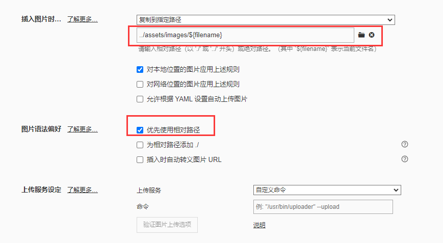

# 运行项目

推荐全局安装 `docsify-cli` 工具，可以方便地创建及在本地预览生成的文档。

```bash
npm i docsify-cli -g
```

## 本地预览

通过运行 `docsify serve` 启动一个本地服务器，可以方便地实时预览效果。默认访问地址 http://localhost:3000 。

```bash
docsify serve docs
```

## 本地编辑
**vscode如何编辑**
vscode下载插件： markdown all in one 
https://blog.csdn.net/weixin_45230019/article/details/118298379

**图片**
当前项目还没有设置图床，若需要插入图片，可以设置图片存放路径为相对路径

