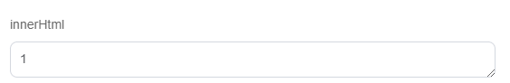

# KooBoo 内置指令

## k-text

**作用：** 更新元素的 `textContent`，插入的内容为文本。

**示例代码：**

```html
<span k-text="与k-content相反，插入的内容为文本"></span>
```

## k-content

**作用：** 更新元素的 `innerHTML`，插入的内容会被解析为DOM。

**示例代码：**

```html
<span
  k-content="`<p class='active'>会解析字符串中的标签</p>`"
></span>
```


!>在网站上动态渲染任意 HTML 是非常危险的，因为容易导致 XSS 攻击。只在可信内容上使用 k-content，永不用在用户提交的内容上。

## k-attribute

**作用：** 动态的绑定一个或者多个attribute，设置多个attribute时用 `;` 分隔表达式

**示例代码：**

```html
<p k-attribute="class attribute? 'active':''">配合三元运算符设置元素的class</p>
<p k-attribute="class attribute1">直接指定元素的class</p>
// 也可以设置元素的src、url等属性

```

?> 当判断较为复杂的时候，可以用方法封装判断。

```js
<script engine="kscript">
 	let attributeHandle = function(key){
        if(key === "mark"){
            return "active"
        }
        return ""
    }   
 </script>

<p k-attribute="class attributeHandle('mark')">Content</p>
```


## k-for

**作用：** 基于源数据循环渲染元素

**示例代码：**

```html
<script>
  ket list = [{name:"张三"},{name:"李四"}]
</script>

<div k-for="(item,index) in list">
  <li k-content="item.name"></li>
</div>
```

## k-if | k-elseif | k-else

**作用：** 根据判断结果，表达式结果为 `false` 隐藏元素

**示例代码：**

```html
<div k-if="kif === 'kif' ">1</div>
<div k-elseif="kif === 'kif1' ">2</div>
<div k-else="">3</div>
```

##  k-placeholder

**作用：** 用于在布局中将元素标记为占位符/容器。组件可以从页面设计器添加到占位符中。

**示例代码：**

```html
<!-- 插槽 -->
<span k-placeholder="main"></span>

<!-- 使用placeholder插入插槽 -->
<!-- id用于指定插槽,和k-placeholder的值相对应 -->
<placeholder id="main">
  <view id="page.sneller"></view>
</placeholder>
```

## k-slot-insret

**作用：** 将内容插入包含插槽的子组件，value 值与`k-solt-define`相对应即可将内容插入插槽中

**示例代码：**

```html
<view id="global_footer">
  <div k-slot-insert="left" class="left_son">left</div>
  <div k-slot-insert="">默认?</div>
  <div k-slot-insert="right" class="right_son">right</div>
</view>
```

## k-slot-define

**作用：** 在组件中定义一个可以接受外部内容的插槽，设定一个插槽的名称。 这个名称与`k-slot-insert`相对应，会将内容进行 **替换**（替换意味着，当你需要一些特殊的类名设置样式来维持结构的稳定的时候，可以在插槽的外部添加一个 div 并添加需要的类名，在 div 的子元素里面使用 k-solt-define）

**示例代码：**

```html
<div class="jumbotron">
  <div k-slot-define="left"></div>
  <div k-slot-define=""></div>
  <div k-slot-define="right"></div>
</div>
```

## k-device

**作用：** 判断当前的设备为移动设备还是桌面设备，与设定的值不符会隐藏元素（无响应式，不稳定）

**示例代码：**

```html
当前设备为：
<span k-device="mobile">mobile</span>
<span k-device="desktop">desktop</span>
```

## k-label

**作用：** 用于指定元素的`textContent`，`k-label`的`value`会在系统中形成一个同名的标签，标签可以在kooboo可以设定值。

**示例代码：**

```html
<body>
  <p k-label="services-first__text--top"></p>
</body>
```

## k-htmlblock

**作用：** 引用kooboo系统中设置的`HTML代码块`

**示例代码**

```html
<div k-htmlblock="ninjible-now_STA-page_call-to-action"> value 为 HTML代码块的名称 </div>
```


## k-config

**作用：** 提供一个名称，会在在后台可以进行控制元素显示的内容。

**示例代码**

```html
<div k-config="aaabbb">1</div>
1</img>
<a k-config="cccddd">1</a>
```

？> 根据元素的不同，kooboo在后台可以设置不同的属性。

**div标签**



**img标签**


