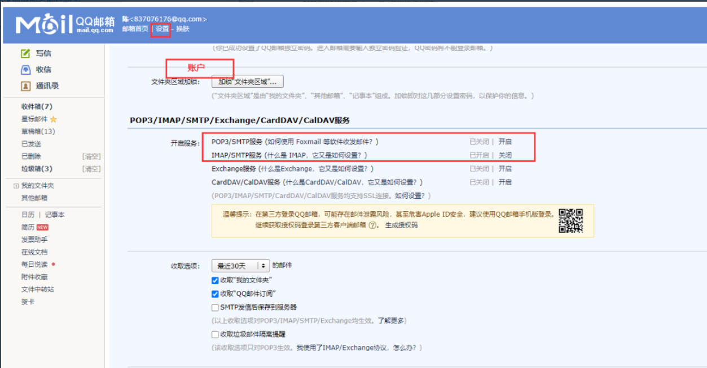
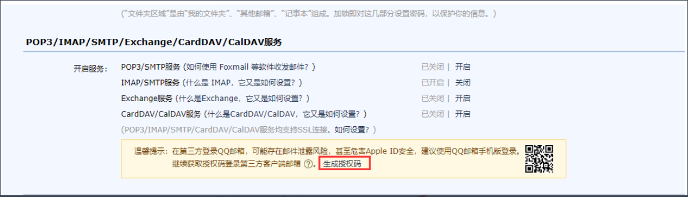

# kooboo 案例

##  kooboo 中使用axios的探究

> 由于 kooboo 主打 SSR 服务器渲染的模式，所以在我接触的众多项目中，发送 axios 请求的次数很少。 但是一旦需要发送 ajax 请求，经常需要利用原生的 XHR 写一大堆代码进行发送， 而没有用上社区中有很多关于 ajax 的库。
>
> 因此我想通过一个 demo 来测试使用如今前端最流行的 ajax 框架：axios。 将其在 kooboo 项目中进行应用，探究其在以后项目中使用的可能性。

1. **下载 axios.js**

     - [axios@1.1.2_mini](https://unpkg.com/axios@1.1.2/dist/axios.min.js)

     - 在 kooboo 的`脚本`中创建`外部脚本`,然后将 axios 的文件替换进去

2. **创建 axios-extends.js**

此文件的作用是对 axios 进行二次封装，基本配置可以参考如下代码

  ```js
  // 1. 创建一个新的axios实例
  // 2. 请求拦截器，
  // 3. 响应拦截器：

  // 基准地址
  const baseURL = "http://127.0.0.1:5000";
  const instance = axios.create({
    baseURL,
    timeout: 5000,
  });

  // 请求拦截器
  instance.interceptors.request.use(
    (config) => {
      return config;
    },
    (err) => {
      return Promise.reject(err);
    }
  );
  // 响应拦截器
  instance.interceptors.response.use(
    (res) => res.data,
    (err) => {
      if (err.response && err.response.status === 401) {
      }
      return Promise.reject(err);
    }
  );

  // 请求工具函数
  const _axios = (url, method, submitData) => {
    return instance({
      url,
      method,
      [method.toLowerCase() === "get" ? "params" : "data"]: submitData,
    });
  };
  ```

3. **针对网页的需要使用到的 api 进行封装请求函数**

```js
<script>
    /* 这里的函数可以封装到单独的js文件中，也可以写在页面的script标签中 */
    let queryGetInfo = async () => {
        let data = await _axios("/test", "get")
        return data
    }
    let queryPostInfo = async () => {
        let data = await _axios("/test", "post")
        return data
    }
</script>
```

4. **在页面中进行使用**

```html
<!-- 页面脚本 -->
<script>
  let get = async (methods) => {
    let data = null;
    const myInput = document.querySelector('input[type="text"]');
    if (methods === "get") {
      data = await queryGetInfo();
    } else {
      data = await queryPostInfo();
    }
    myInput.value = data.methods;
  };
</script>

<body>
  <input placeholder="数据在这" type="text" />
  <button onclick="get('get')">获取get数据</button>
  <button onclick="get('post')">获取post数据</button>
</body>
```

?> 到此,我们所定义的axios和定义的两个api函数均可以正常运行,页面的功能为点击 `获取get数据` 或 `获取post数据`按钮时发送请求,请求回来的数据展示在input中

!> **需要注意的,使用axios的时候引入的先后顺序要正确。**


## 使用QQ邮箱在kooboo中发送邮件
**第一步 在设置/账户 开启服务**



**第二步 生成授权码**



**第三步 代码实现**

```js
let devMailService = k.content.DEV_mailService.all()[0] // 邮件模板
msg.from = devMailService.username // 发送人
var server = k.mail.createSmtpServer(); // 获取邮件对象
server.host = "smtp.qq.com"; // QQ邮箱的SMTP服务器地址
server.port = 465; // QQ邮箱的SMTP服务器端口
server.ssl = true; // 开启SSL
server.username = devMailService.username // 连接对应服务的账户
server.password = devMailService.password // 对应账户的密码 (授权码)
k.mail.smtp.smtpSend(server, msg); //发送
k.response.json({ success: 'is send Success' }) //发挥成功信息
```

!> 注意这边的密码需要填写授权码， 登录账号和msg.to指向的邮箱要对应


## 账号登录

实现步骤....(可以放案例链接)


## 文件系统

实现步骤....(可以放案例链接)
