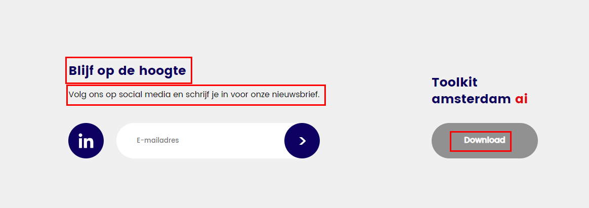
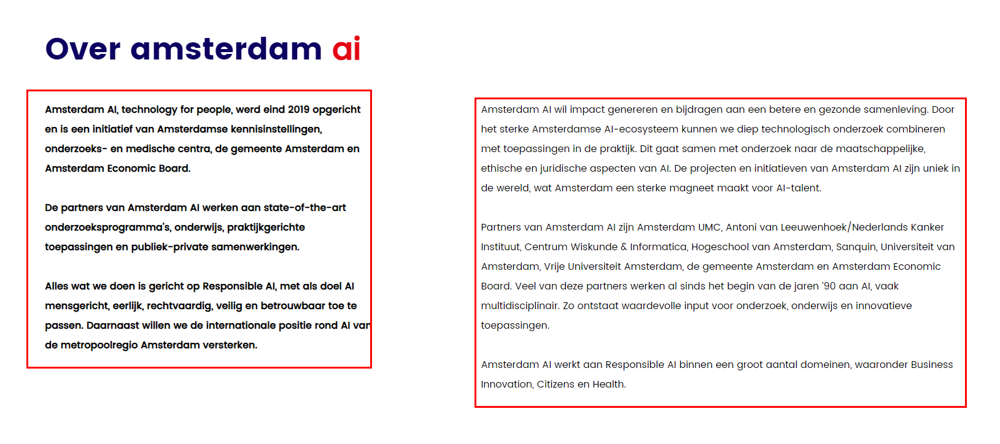

# AmsterdamAI项目总结

## 1.页面中的各种内容如何交给Kooboo管理

- #### 基础文本



这种明显不需要换行切无粗体、链接等格式的文字一般交给 `k-label` 来管理即可

```html
<p k-label="labelName">  </p>
```


- #### 富文本



当文字有多个自然段，或者一个句子中带有链接的时候就可以使用`htmlblock`控制

```html
<htmlblockl id="htmlblockId">
	id指向对应的html代码块的内容
</htmlblock>
```

- #### 重复项


当有多个重复项的时候，数据的存储要现在`内容/数据结构` 中完善数据结构，然后在 `内容/内容`  中填写内容，然后就可以在kscript中取到数据，利用 `k-for` 进行渲染

```html
<script env="server">
 let info = k.content.Nieuws.all() //取到Nieuws中所有的数据 
</script>
// 渲染
<div k-for="item info">
    <a class="w-full relative block mb-[8px] xl:mb-[0px]  relative"
        k-attribute="href `/cases/${item.id}/${changeUrlReadly(item.title)}` ; class index === 3 ? 'hide-desktop_lg':''">
        <div class="h-full flex justify-center items-center rounded-[25px] xl:rounded-[50px] overflow-hidden caseItem">
            <p class="absolute text-[15px] xl:text-[30px] text-white font-bold text-center z-3 p-[25px] xl:p-[50px] font-main-bold"
                k-text="item.title">
                Discovery Lab
            </p>
            <div class="absolute z-2 bg-main-blue w-full h-full opacity-40" k-if="item.imageHome">
            </div>
            <div class="absolute z-2 bg-main-blue w-full h-full" k-if="!item.imageHome">
            </div>
            
        </div>
    </a>
</div>
```


- ####  图片


网站上较为独立的图片可以使用 `k-config` 进行管理，使用k-config之后可以在在线编辑中替换不同的图片。

!> 缺点：管理之后，就不能在代码上直接修改image标签的class(对于tailwind不太友好)，只能在kooboo中配置

```html

```

- #### 主导航


对于这种主导航，在没有很特殊的情况下，可以使用kooboo内置的 `开发/菜单` 进行配置使用


## 2. 项目经验

#### 2.1图片的比例适配方案


类似上图中的图片通常是需要固定比例的，可能是16/9的比例。 在屏幕缩放的过程中，图片的宽度可能会随着屏幕的缩小而缩小，所以需要有一个解决方案来动态调整图片的高度。

**方案1：  aspect-ratio**

| Class         | Properties            |
| ------------- | --------------------- |
| aspect-auto   | aspect-ratio: auto;   |
| aspect-square | aspect-ratio: 1 / 1;  |
| aspect-video  | aspect-ratio: 16 / 9; |

!> 这种方法简单快捷，但是在某些浏览器和手机上不会识别此属性，可能会出现画面崩掉的情况。

**方案2: 伪元素+padding**

```html
<div class="w-full overflow-hidden rounded-[25px_25px_0px_0px] xl:rounded-[50px_50px_0px_0px] aboutItemImage">
    
</div>

<style>
    .aboutItemImage {
        position: relative;
    }

    .aboutItemImage::before {
        content: "";
        display: block;
        padding-top: 50%;
    }
</style>
```

!> 使用伪元素的padding撑开div的高度，好处是不会有兼容问题，


#### 2.2公共组件渲染

当一个元素需要再多个页面使用的时候，就适合封装成组件在多个页面使用，这样子可以有效避免修改错误。


#### 2.3youtube视频解决方案

可以对youtube的分享链接做适配，提取当中的`id`进行拼接，使用`k-content` 插入容器中

```javascript
 Utils.setYUBVideo = (url) => {

        let videoId = ''
        if (url.includes('youtu.be/')) {
            videoId = url.split('youtu.be/')[1]
        } else if (url.includes('v=')) {
            videoId = url.split('v=')[1]
        }
        if (videoId !== '') {
            videoId = videoId.split('&')[0]
            url = `https://www.youtube.com/embed/${videoId}`
        }
        let result = `
        <iframe width="100%" height="100%" src="${url}" style="position: absolute;left: 0;top: 0;"  title="YouTube video player" frameborder="0" allow="accelerometer; autoplay; clipboard-write; encrypted-media; gyroscope; picture-in-picture; web-share" allowfullscreen></iframe>
        `
        return result
    }

```

!> 要注意布局方式 , url可能没有适配到全部场景


#### 2.4分享解决方案(twitter、facebook、linkedin、复制链接)

这里主要参考了两篇CSDN文章

1. https://blog.csdn.net/qq_25452801/article/details/120075424
2. https://blog.csdn.net/weixin_39841156/article/details/81094132

主要步骤如下: 1.设置好相应的平台的baseUrl，2.设置好og：mate标签让平台进行查询 3.分享测试

!> 这里分享这个项目中封装的分享解决方案代码

```js
/* og:mate start */
let newsId = k.request.newsId 
let eventId = k.request.eventId
let caseId = k.request.caseId
// 这里区分三个字段是为了区分当前页面是哪个内容,因为不同内容有不同的字段,要设置不同的title,image等
let metaObj = {} // 存储meta标签的配置信息
let info = {} //存储信息元数据
if (newsId) {
    info = k.content.Nieuws.get(newsId)
    metaObj = {
        twCard: '',
        twSite: '',
        twCreator: '',
        twImage: k.info.BaseUrl + info.HeaderImageNewsPage,
        ogUrl: k.request.url,
        ogTitle: info.title,
        ogDesctipt: removeTags(info.IntroText),
        ogImage: info.HeaderImageNewsPage
    }
} else if (eventId) {
    info = k.content.Events.get(eventId)
    metaObj = {
        twCard: '',
        twSite: '',
        twCreator: '',
        twImage: k.info.BaseUrl + info.headerImageNewsPage,
        ogUrl: k.request.url,
        ogTitle: info.title,
        ogDesctipt: removeTags(info.IntroText),
        ogImage: info.headerImageNewsPage
    }
} else if (caseId) {
    info = k.content.Cases.get(caseId)
    metaObj = {
        twCard: '',
        twSite: '',
        twCreator: '',
        twImage: k.info.BaseUrl + info.ImageHome,
        ogUrl: k.request.url,
        ogTitle: info.title,
        ogDesctipt: removeTags(info.IntroText),
        ogImage: info.ImagePage || info.ImageHome
    }
}
let mate = addMetaTags(metaObj) // 将meta配置信息传递给addMetaTags方法,会返回一个字符串拼接的meta标签
k.response.write(mate) // 将这个标签输出(注意: 这个方法要在页面中的head执行)
/* og:mate end */

// 这是Meta生成方法,Meta标签可拓展
function addMetaTags(metaObj) {
    const ogMeta = {
        twCard: `<meta name="twitter:card" content="${metaObj.twCard}" />`,
        twSite: `<meta name="twitter:site" content="${metaObj.twSite}" />`,
        twCreator: `<meta name="twitter:creator" content="${metaObj.twCreator}" />`,
        twImage: `<meta name="twitter:image" content="${metaObj.twImage}">`,
        ogUrl: `<meta property="og:url" content="${metaObj.ogUrl}" />`,
        ogTitle: `<meta property="og:title" content="${metaObj.ogTitle}" />`,
        ogDesctipt: `<meta property="og:description"  content="${metaObj.ogDesctipt}" />`,
        ogImage: `<meta property="og:image" content="${metaObj.ogImage}" />`,
        // ogAuthor = `<meta name="author" content="${metaObj.ogAuthor}">`
    }
    let result = ''
    Object.keys(ogMeta).forEach(item => {
        if (metaObj[item]) {
            result += ogMeta[item]
        }
    })
    return result
}
// 删除富文本中的所有标签,避免Meta标签出错
function removeTags(str) {
    if ((str === null) || (str === '')) {
        return false;
    } else {
        str = str.toString();
    }
    // 利用正则表达式替换 html 标签
    return str.replace(/<[^>]+>/g, '');
}
```


#### 2.5axios使用

!> 在AmsterdamAI这个项目中，使用了axios来管理所有需要发送的ajax接口。好处是代码结构清晰，接口好管理。 axios的文件较小，对lighthouse分数的影响也很小，相比之下 代码的可阅读性提高了，可以在其它项目中使用!!


#### 2.6多媒体查询适配（tailwind）

!> 如果使用tailwind作为CSS开发工具的话，多媒体查询最好和tailwind内置的媒体查询规则一致，统一使用 **min-width** 规则来适配，并且 **以移动设备为先**

| 断点前缀 | 最小宽度 | CSS                                  |
| -------- | -------- | ------------------------------------ |
| `sm`     | 640px    | `@media (min-width: 640px) { ... }`  |
| `md`     | 768px    | `@media (min-width: 768px) { ... }`  |
| `lg`     | 1024px   | `@media (min-width: 1024px) { ... }` |
| `xl`     | 1280px   | `@media (min-width: 1280px) { ... }` |
| `2xl`    | 1536px   | `@media (min-width: 1536px) { ... }` |

 


#### 2.7UserKey的使用（Url美化)


> 应用场景: UserKey可以作为id的代替，可以让用户自由填写数据的唯一标识。在某些情况下，会需要传递id来查询详细数据，如：`/en/cases/2c7a30c3-a453-c3e2-53d7-e72881442e95/Civic-AI-Lab` ， 其中 id 为: `2c7a30c3-a453-c3e2-53d7-e72881442e95` 这样子其实是不美观的，而开启UserKey之后，用户可以填写想要的设置的唯一标识，会使得Url更加的美观，如：`/en/cases/Civic-AI-Lab`
